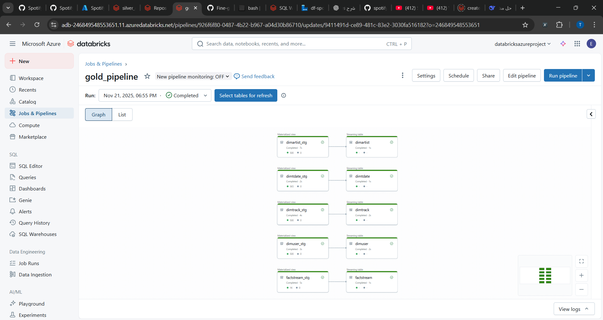
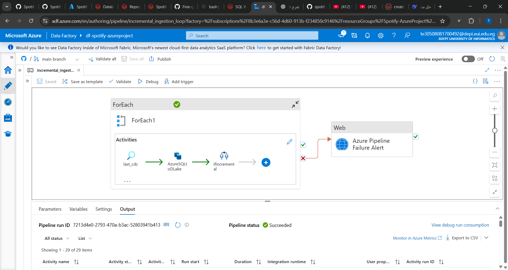
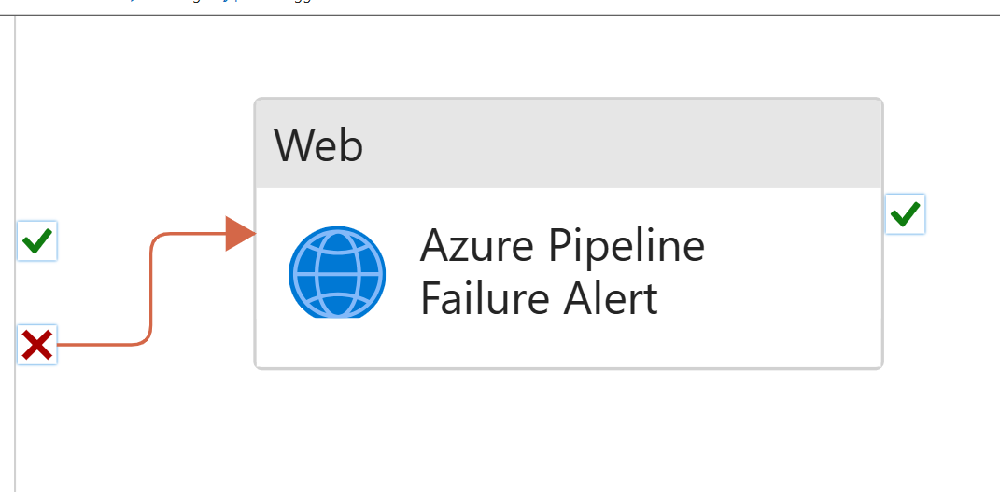
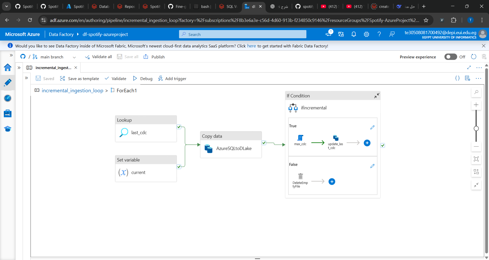
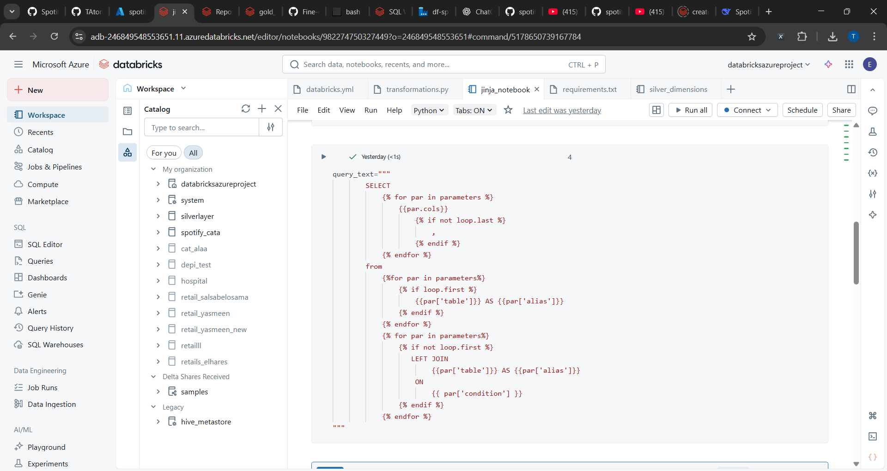
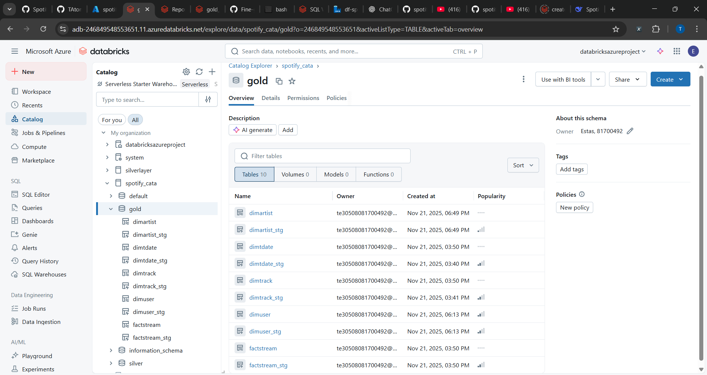
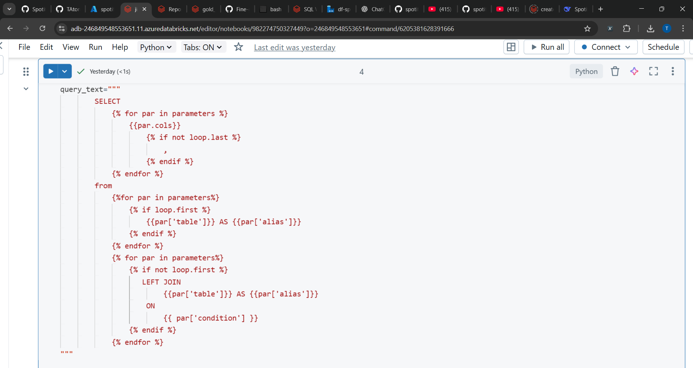
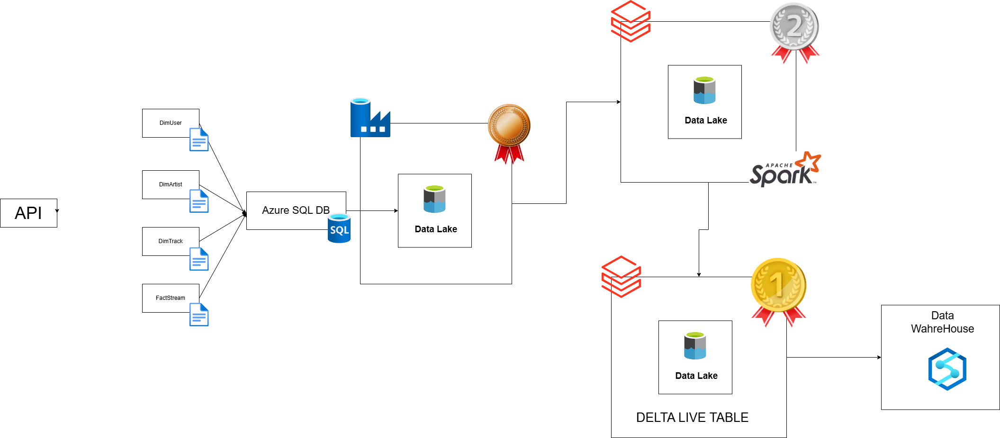
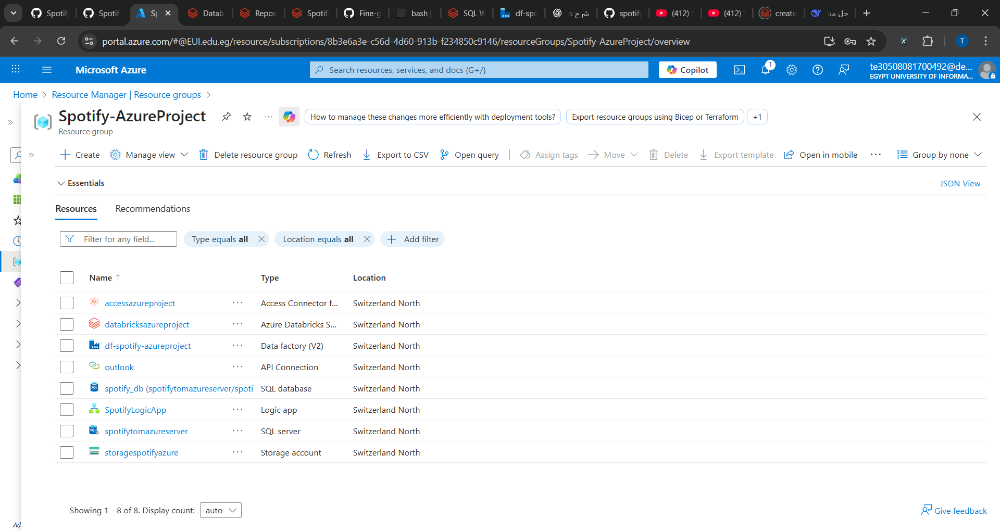

# Spotify Azure ETL — Scalable Data Platform

An end-to-end Azure data pipeline for ingesting, refining, and evolving Spotify-like streaming data. This project demonstrates production-ready patterns using Azure Data Factory (ADF), Azure Data Lake Storage (ADLS), Databricks (Autoloader and Delta), and Databricks Delta Live Tables (DLT) for SCD/CDC flows.

---

## Short Project Description
Spotify Azure ETL is a proof-of-concept data engineering solution for streaming and incremental ingestion from an Azure SQL Server into ADLS, followed by Databricks transformations that produce silver Delta and gold SCD-type outputs. The repo bundles ADF pipelines, Databricks notebooks, DLT flows, and deployment resources.

## Problem Statement
- Modern analytics platforms need reliable patterns to ingest continuously changing source data while preserving history and enabling downstream analytics.
- Teams often struggle to: handle incremental CDC ingestion, land raw data efficiently, standardize transformations, and maintain SCD Type 2 history for master data.

## Solution Overview
This repository provides a repeatable architecture to:
- Use ADF for incremental extraction from Azure SQL into Parquet files (bronze) in ADLS.
- Use Databricks Auto Loader to ingest bronze Parquet into Delta tables (silver), applying transformations and deduplication.
- Use Databricks Delta Live Tables (DLT) to create `gold` tables with SCD Type 2 history, capturing changes for analytics and BI.

## Why This Project Is Strong
- Designed end-to-end: integrates ingestion (ADF), storage (ADLS), processing (Databricks), and serving (DLT).
- Scalable and incremental: Autoloader + Delta Lake ensures efficient data processing for large files and streaming workloads.
- Robustness: ADF loop and CDC JSON tracking fosters safe incremental runs; DLT provides managed, declarative data pipelines and SCD handling.
- Reproducible: infrastructure artifacts and Databricks bundle make it easy to deploy and adapt to a new environment.

## Features
| Feature | Description |
|---|---|
| Incremental Ingestion (ADF) | Copy queries Azure SQL by `cdc` column and writes Parquet to ADLS (bronze). |
| Auto-loader (Databricks) | Streams Parquet to Delta `silver` tables with deduplication and transformations. |
| DLT gold (SCD Type 2) | Declarative flows that produce `gold` tables with SCD Type 2 history. |
| CDC tracking | `cdc.json` stored in storage to track last processed CDC value per table. |
| Parameterized ADF loop | `incremental_ingestion_loop` supports multiple tables via `loop_input`. |

## Screenshots / Images
Below are illustrative images pre-saved in the repository. These show ADF pipelines, Databricks UI, and architecture diagrams.

*ETL_db* — A high-level diagram showing data flow from Azure SQL to ADLS and Databricks.

*Etl-df* — Azure Data Factory: pipeline configuration.

*df-spotify-azureproject - Azure Data Factory* — ADF pipeline view (incremental_ingestion_loop).

*df-insideforeach* — ADF ForEach details showing per-table copy activities.

*Databricks* — Notebook / Pipeline view for silver ingestion.

*Gold* — Example of gold tables in Databricks (DLT) processed with SCD logic.

*gold - Databricks* — DLT pipeline listing and job run summary.

*jinja_notebook* — Example Jinja Notebook used for templating.

*Spotify.drawio* — Architecture diagram (draw.io export) of the solution.

 - Microsoft Azure - Google Chrome 11_21_2025 11_43_33 PM.png)
*spotify_db* — Azure SQL Database resource in Azure portal.

*spotify-Resource* — Azure resource group and services overview.

## Technologies Used
| Layer | Tool / Framework |
|---|---|
| Orchestration | Azure Data Factory (ARM JSON templates) |
| Storage | Azure Data Lake Storage Gen2 (ADLS) |
| Compute | Databricks (Autoloader, Delta Lake, DLT) |
| Source DB | Azure SQL Database |
| Infra / IaC | ADF JSON artifacts and Databricks bundle YAML |
| Development | Python, PySpark, Delta Live Tables (DLT), Jinja templates |

## Project Architecture / Workflow
1. ADF Pipeline (`incremental_ingestion` / `incremental_ingestion_loop`) runs scheduled or ad-hoc jobs.
2. For each table in `loop_input`, ADF fetches `last_cdc` from `bronze/<table>_cdc/cdc.json` and extracts rows newer than that from Azure SQL.
3. ADF writes the new rows as Parquet to `abfss://bronze@<storage>/table` (folder per table) and updates `cdc.json` using `max_cdc`.
4. Databricks Autoloader (`cloudFiles`) loads Parquet from bronze to Delta (`spotify_cata.silver.<Table>`), runs transformations, and deduplicates.
5. Databricks DLT consumes Delta silver tables and creates `gold` tables using `create_auto_cdc_flow` for SCD Type 2 history.

## How to Run the Project — Quick Start
Prerequisites: Azure subscription, a Databricks workspace, and an Azure SQL database containing the seed data.

1. Prepare Azure resources:
   - Create or reuse an Azure Data Lake Storage Gen2 account and a container `bronze` and `silver`.
   - Provision an Azure SQL database and run `source_scripts/spotify_initial_load.sql` to create seed tables.

2. Configure ADF and Databricks:
   - In the ADF JSON files under `linkedService`, set credentials for `AzureDataLakeStorage1` and `AzureSqlDatabase1`.
   - Deploy the Data Factory artifacts (or import the JSON definitions) into an ADF instance.
   - In `spotify_dab/databricks.yml` and `resources/` files, update `workspace.host`, `root_path`, and job/pipeline parameters to match your Databricks workspace.

3. Deploy Databricks project and DLT:
   - Install the Databricks CLI and authenticate: `databricks configure`
   - Deploy the bundle: `databricks bundle deploy --target dev`
   - Run sample job: `databricks bundle run`

4. Run and validate:
   - Start the ADF pipeline `incremental_ingestion_loop` via the Data Factory UI or API.
   - Monitor Parquet files landing in `bronze` container. Validate Delta silver tables under `spotify_cata.silver`.
   - Check DLT job status and the historical gold tables.

**Important:** Parameterize the host, SQL credentials, and Logic App webhook URL before deployment. Avoid committing secrets.

## Future Improvements
- Add CI/CD pipeline to automatically lint, test, and deploy ADF, Databricks, and DLT resources.
- Add unit and integration tests (pytest) for core transformation logic.
- Add automated checkpoints & monitoring for failed ADF runs and DLT pipeline failures.
- Add role-based access and centralized secret management (Azure Key Vault) for credentials and webhook URLs.
- Add sample notebooks for interactive analysis and dbt integration for analytics models.

## Contribution
Contributions are welcome. Please open an issue, or submit a PR with a short description and targeted changes.

## License
This project is licensed under the MIT License — see `LICENSE` for details.

---

If you want, I can also:
- Fix the minor typos in DLT scripts and standardize naming across the repo.
- Add a `README.md` to the `spotify_dab` folder with quick running instructions for Databricks.

Happy to continue — tell me which task to do next.
